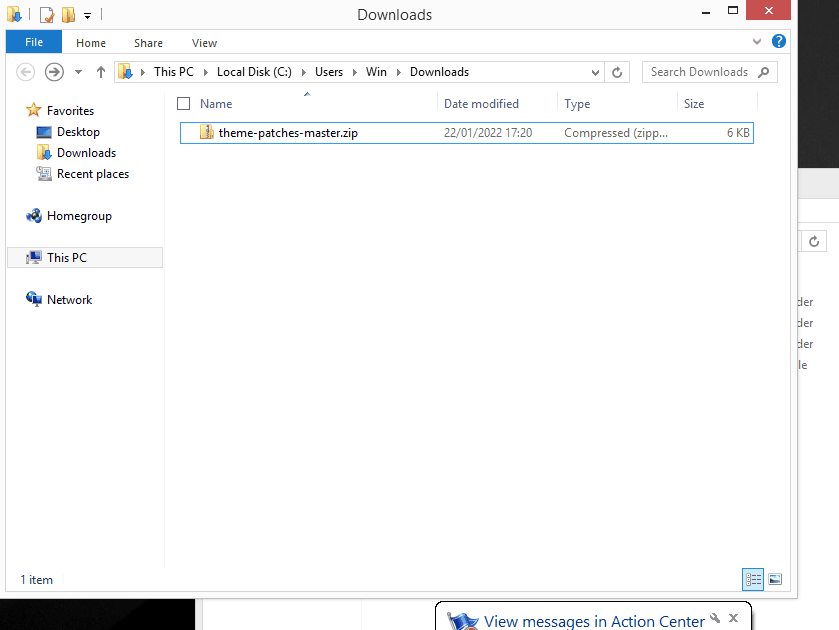

# Theme patches
This repository contains the home menu patches needed for custom themes.

For future firmware the ips files will be uploaded here and the theme installer will automatically download them so you won't need to manually downlaod latest version for each update.

This feature is available starting from NXThemesInstaller 2.7

## If you don't want to connect your console to the internet
1) Make sure latest firmware support has been added, read the commit messages.
2) Download this repo by [clicking here](https://github.com/exelix11/theme-patches/archive/refs/heads/master.zip), you'll get a zip file
3) Copy just the `systemPatches` folder from the zip file to the `themes` folder on your sd 
4) Launch the theme installer, it will automatically find the patches your console needs and install them.
